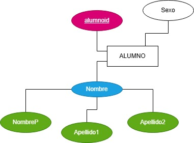

# EJERCICIOS MODELO E-R 

1. Ejercicio 1

En un hospital se registra información de sus pacientes 
---
## De cada paciente se desea almacenar:

    - Algo que lo identifique
    - Nombre
    - Fecha de Nacimiento

## De un expediente médico se almacena:

    - Número de Expediente
    - Fecha de Apertura
    - Tipo de Sangre

## Reglas del Negocio

    1. Cada paciente debe tener exactamente un expediente médico
    2. Cada expediente pertenece a un único paciente 
    3. No puede existir ningún expediente médico sin paciente 
    4. No puede existir un paciente sin un expediente

## Resultado Modelo E-R

2. Ejercicio 2

Una Universidad administra profesores y cursos.

> De cada Profesor se almacena:

- Clave profesor
- nombre
- especialidad

> De cada Curso se almacena:
- Identificación del curso
- Nombre del Curso
- Créditos

> Reglas del Negocio

1. Un profesor puede impartir varios cursos
2. Un curso solamente puede ser impartido por un profesor
3. Puede existir un profesor que actualmente no imparta cursos.
4. Todo curso debe ser asignado a un profesor 

Se debe realizar lo siguiente:

- Entidades
- Identificar la Relación **IMPARTE**
- Determinar la Cardinalidad
- Determinar la participación

Ejercicio 4. 

Una empresa encargada de realizar venta de productos:

>De cada cliente se almacena: 

- Numero de cliente que lo identifique
- y su nombre de cliente el cual es una persona moral
- RFC

> La empresa realiza pedidos en los cuales almacena lo siguiente:

- numero de pedido
- Fecha

> La empresa tambien almacena productos de los cuales registra lo siguiente:

- numero de producto
- nombre 
- precio 

> Al realizar los pedidos deben registrar la cantidad de productos pedidos y su precio

>Reglas del Negocio

1. Un cliente puede realizar muchos pedidos
2. Cada pedido pertenece a un solo cliente
3. Un pedido puede contener varios productos
4. Un producto puede aparecer en muchos pedidos
5. Un pedido debe contener al menos un producto
6. Un producto puede no haber sido vendido
7. El detalle del pedido no existe sin pedido
8. El detalle de pedido no existe sin producto
9. El detalle almacen cantidad y precio de venta

