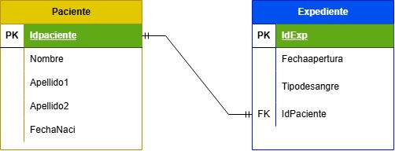

# Diccionario de Datos de la base de datos de Control Escolar

1. Información General 

| Elemento | Valor |
| :--- | :--- |
| Proyecto | Control Escolar |
| Version   | 1.0 |
| Fecha   | Junio 2026 |
| Elaboro   | Ing. José Luis Herrera Gallardo, MTI |
| SGBD   | SQLServer |

2. Descripción del Sistema de Base de Datos

El sistema administra:
- Carreras
- Alumnos
- Profesores
- Materias
- Grupos
- Inscripciones

Permite controlar la oferta académica y la inscripción de estudiantes.

3. Catalogo de Restricciones utilizadas

| Código | Significado |
| :--- | :--- |
| PK | Primary Key |
| FK   | Foreign key |
| NN   | NOT NULL |
| UQ   | UNIQUE |
| AI   | Auto Increment |
| CK   | Check |
| DF   | Default |

4. Diccionario de Datos

## Tabla: Carrera

**Descripción**
Almacena las carreras ofertadas por la universidad 

| Campo  | Tipo | Longitud | Restricciones | Descripción |
| :--- | :--- | :--- | :--- | :--- |
| id_carrera | INT | - | PK, AI, NN | Identificador único de la carrera |
| nombre | VARCHAR | 100 | UQ, NN | Nombre de la carrera |
| duracion_cuatrimestre | INT | - | NN, CK(>0) | Nombre de la carrera |

--

## Tabla: Alumno

**Descripción**
Almacena Información de los estudiantes

| Campo  | Tipo | Longitud | Restricciones | Descripción |
| :--- | :--- | :--- | :--- | :--- |
| id_alumno | INT | - | PK, AI, NN | Identificador único del alumno |
| matricula | VARCHAR | 10 | UQ, NN | Matricula Institucional |
| nombre | VARCHAR | 30 | NN | Nombre del Alumno|
| apellido_paterno | VARCHAR | 50 | NN | Apellido Paterno |
| apellido_materno | VARCHAR | 50 | NULL | Apellido Materno |
| correo | VARCHAR | 100 | UQ, NN | Correo Institucional |
| fecha_nacimiento | DATE | - | NN | Fecha de nacimiento |
| id_carrera | INT | - | FK, NN | Carrera a la pertenece |

-- 

5. Relaciones en la bd

| Relación  | Cardinalidad | Descripción|
| :--- | :--- | :--- |
| Carrera -> Alumno | 1:N | Una carrera tiene muchos alumnos |
| Carrera -> Materia | 1:N | Una carrera tiene muchas materias |
| Profesor -> Grupo | 1:N | Una carrera puede impartir varios grupos |
| Materia -> Grupo | 1:N | Una materia puede abrirse en varios grupos |
| Alumno -> Inscripción | 1:N | Un alumno puede tener varias inscripciones |
| Grupo -> Inscripción | 1:N | Un grupo puede tener muchos Alumnos |

6. Matriz de Claves Foráneas

| Tabla  | Campo FK | Referencia |
| :--- | :--- | :--- |
| Alumno | id_carrera | Carrera(id_carrera) |
| Materia | id_carrera | Carrera(id_carrera) |
| Grupo | id_profesor | Profesor(id_profesor) |
| Grupo | id_materia | Materia(id_materia) |
| Inscripcion | id_alumno | Alumno(id_alumno) |
| Inscripcion | id_grupo | Grupo(id_grupo) |

7. Integridad Referencial 

| Codigo | Regla |
| :--- | :--- |
| IR-01 | No se puede registrar un alumno con una carrera inexistente |
| IR-02  | No se puede crear un grupo para una materia inexistente |
| IR-03  | No se puede crear un grupo para una profesor inexistente |
| IR-04  | No se puede inscribir un alumno en un grupo inexistente |
| IR-05  | No se puede eliminar una carrera que tenga alumnos asociados sin antes reasignarlos o eliminarlos |

8. Reglas del Negocio

| Codigo | Regla |
| :--- | :--- |
| RN-01 | Un alumno pertenece a una sola carrera |
| RN-02  | Una carrera puede tener muchos alumnos |
| RN-03  | Una carrera puede tener muchas materias|
| RN-04  | Un profesor puede impartir varios grupos |
| RN-05  | Un grupo solo puede tener un profesor asigando |
| RN-06  | La calificación debe estar entre 0.0 y 10.0 |

9. Diagrama Relacional 

